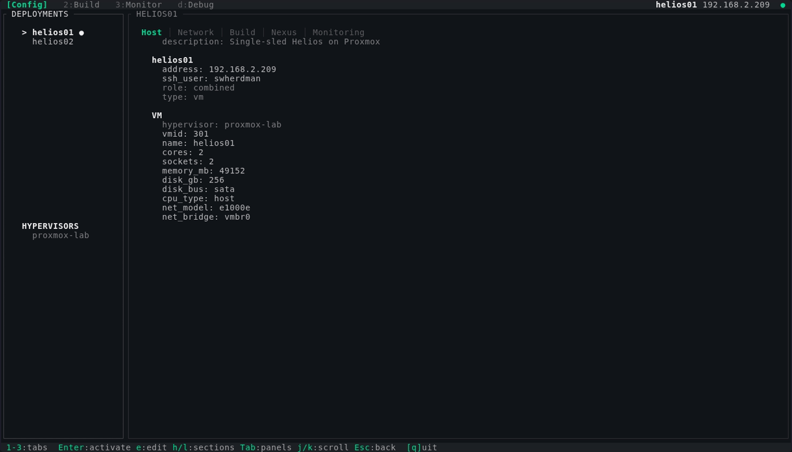

# whoah-cli — We Have Oxide At Home CLI

> [!WARNING]
> **Pre-alpha software.** This project is under active development and not yet ready for general use. If you're interested in running Oxide at home and want to get involved, [reach out](https://swherdman.com/portfolio/whoah/).

A TUI/CLI tool for deploying [Oxide](https://oxide.computer) on non-Oxide hardware. Automates the full lifecycle from VM provisioning through Omicron build and deployment, so you can run a real Oxide rack at home.



## What it does

WHOAH automates the multi-step process of deploying Oxide's control plane on commodity hardware:

1. **Provision** — Creates a VM on your hypervisor, installs Helios (Oxide's illumos distro), and configures networking
2. **Configure** — Sets up SSH access, user accounts, and package caching for faster builds
3. **Build** — Installs prerequisites, clones Omicron, applies configuration overrides, and compiles the full Oxide stack
4. **Deploy** — Creates virtual hardware, installs the Omicron package, and verifies DNS and API health
5. **Patch** — Applies necessary patches for non-native hardware (e.g., propolis string I/O emulation for nested virtualization)

The TUI provides real-time progress tracking with streaming build output, a debug screen for SSH session monitoring, and a dashboard for monitoring your deployment.

## Supported platforms

| Hypervisor | Status |
|---|---|
| Proxmox VE | Supported |
| Others | Planned |

## Quick start

### Prerequisites

- A Proxmox VE host with enough resources (4 cores, 48GB RAM, 256GB disk recommended)
- The [Helios install ISO](https://docs.oxide.computer) available on your Proxmox storage
- Rust toolchain on your local machine
- [GitHub CLI](https://cli.github.com/) (`gh`) for the git ref selector (optional, falls back to curl)

### Install

```bash
git clone https://github.com/swherdman/whoah-cli.git
cd whoah-cli
cargo build --release
```

### Initialize a deployment

```bash
./target/release/whoah init
```

This creates a deployment configuration at `~/.whoah/deployments/<name>/` with three files:
- `deployment.toml` — host, network, hypervisor, and Nexus API settings
- `build.toml` — Omicron/propolis build configuration, overrides, and tuning
- `monitoring.toml` — health thresholds and polling intervals

Shared hypervisor definitions live at `~/.whoah/shared/hypervisors/<name>.toml` and are referenced by deployments.

### Launch the TUI

```bash
./target/release/whoah
```

This opens the TUI dashboard. From here you can review and edit your configuration on the Config tab (`1`), then switch to the Build tab (`2`) and press `b` to start the deploy pipeline. The tool handles everything from VM creation through a running Oxide control plane. Use the Monitor tab (`3`) to watch your deployment once it's running.

## Configuration

### deployment.toml

```toml
[deployment]
name = "helios-lab"
description = "Single-sled Helios on Proxmox"

[hosts.helios01]
address = "192.168.2.209"
ssh_user = "swherdman"
role = "combined"
host_type = "vm"

[network]
gateway = "192.168.2.1"
external_dns_ips = ["192.168.2.40", "192.168.2.41"]
infra_ip = "192.168.2.50"
internal_services_range = { first = "192.168.2.40", last = "192.168.2.49" }
instance_pool_range = { first = "192.168.2.51", last = "192.168.2.60" }
# Optional — defaults shown:
# ntp_servers = ["0.pool.ntp.org"]
# dns_servers = ["1.1.1.1", "9.9.9.9"]
# external_dns_zone_name = "oxide.test"
# rack_subnet = "fd00:1122:3344:0100::/56"
# uplink_port_speed = "40G"
# allowed_source_ips = "any"

[nexus]
# All optional — defaults shown:
# silo_name = "recovery"
# username = "recovery"
# password = "oxide"
# ip_pool_name = "default"
# [nexus.quotas]
# cpus = 9999999999
# memory = 999999999999999999
# storage = 999999999999999999

[hypervisor]
ref = "proxmox-lab"

[hypervisor.vm]
vmid = 302
name = "helios02"
cores = 4
sockets = 2
memory_mb = 49152
disk_gb = 256
```

### build.toml

```toml
[omicron]
repo_path = "~/omicron"
# repo_url = "https://github.com/oxidecomputer/omicron.git"
# git_ref = ""  # empty = HEAD of default branch
# rust_toolchain = "1.91.1"

[omicron.overrides]
cockroachdb_redundancy = 3
control_plane_storage_buffer_gib = 5
vdev_count = 3
vdev_size_bytes = 42949672960

[propolis]
repo_path = "~/propolis"
patched = true
source = "github-release"
repo_url = "https://github.com/swherdman/propolis"

# Optional — advanced tuning:
# [tuning]
# svcadm_autoclear = false
# swap_size_gb = 8
# vdev_dir = "/var/tmp"
# memory_earmark_mb = 6144
# vmm_reservoir_percentage = 60
# swap_device_size_gb = 64
```

### monitoring.toml

```toml
[thresholds]
rpool_warning_percent = 85
rpool_critical_percent = 92
vdev_warning_gib = 35
oxp_pool_warning_percent = 85

[polling]
status_interval_secs = 10
disk_interval_secs = 30
```

### Shared hypervisor config

```toml
# ~/.whoah/shared/hypervisors/proxmox-lab.toml
[hypervisor]
name = "proxmox-lab"
type = "proxmox"

[credentials]
host = "192.168.2.5"
ssh_user = "root"

[proxmox]
node = "PVE"
iso_storage = "local"
disk_storage = "local-lvm"
iso_file = "helios-install-vga.iso"
```

## TUI Screens

| Key | Screen | Description |
|---|---|---|
| `1` | Config | Tabbed configuration browser (Host, Network, Build, Nexus, Monitoring) |
| `2` | Build | Pipeline progress with streaming output |
| `3` | Monitor | Dashboard with zone, disk, and service status |
| `d` | Debug | Live SSH sessions, mux masters, Docker containers |

## Architecture

- **Build pipeline** — 8-phase execution model (Provision → Configure → Cache → OS Setup → Build → Patch → Deploy → Configure) with per-step progress tracking
- **SSH** — Pure-Rust SSH2 via `russh` with native channel multiplexing (no ControlMaster, no external processes)
- **Serial console** — Automated Helios installation via socat over SSH to Proxmox
- **Package caching** — Local nginx reverse proxy + squid SSL-bump forward proxy for build acceleration
- **Git ref selector** — Branch/tag/commit picker with GitHub API integration, session caching, and autocomplete. Provider trait for future GitLab/generic support.
- **Key event routing** — Helix compositor pattern (`EventResult::Consumed/Ignored`) for consistent keyboard handling across screens and input overlays
- **Patched propolis** — Automated build pipeline via GitHub Actions on a self-hosted illumos runner ([swherdman/propolis](https://github.com/swherdman/propolis))

## Links

- [Project page](https://swherdman.com/portfolio/whoah/)
- [Oxide Computer](https://oxide.computer)
- [Omicron](https://github.com/oxidecomputer/omicron) — Oxide's control plane
- [Propolis fork](https://github.com/swherdman/propolis) — Patched VMM with pre-built releases

## License

[MIT](LICENSE)
